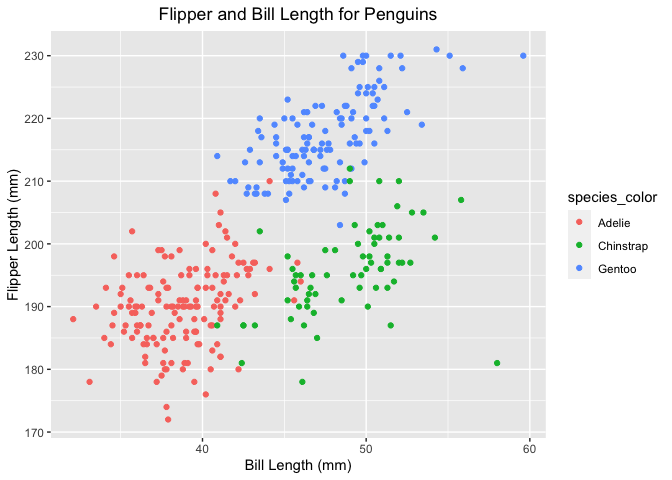

p8105\_hw1\_pw2551
================
Paula Wu
9/23/2021

``` r
# I set message = FALSE for concision
library(tidyverse)
```

### **Problem 1**:

``` r
set.seed(1) 
p1_df = tibble(
  vec_numeric = rnorm(10),
  vec_logical = vec_numeric > 0,
  vec_char = c("will", "you", "get", "a", 
                 "headache", "if", "you", "think", "too", "hard"),
  vec_factor = factor(c("high", "low", "medium", "high", "medium", 
                        "medium", "low", "high", "high", "low"))
)
p1_df
```

    ## # A tibble: 10 × 4
    ##    vec_numeric vec_logical vec_char vec_factor
    ##          <dbl> <lgl>       <chr>    <fct>     
    ##  1      -0.626 FALSE       will     high      
    ##  2       0.184 TRUE        you      low       
    ##  3      -0.836 FALSE       get      medium    
    ##  4       1.60  TRUE        a        high      
    ##  5       0.330 TRUE        headache medium    
    ##  6      -0.820 FALSE       if       medium    
    ##  7       0.487 TRUE        you      low       
    ##  8       0.738 TRUE        think    high      
    ##  9       0.576 TRUE        too      high      
    ## 10      -0.305 FALSE       hard     low

``` r
#take the mean of each variable
mean(pull(p1_df, vec_numeric))
## [1] 0.1322028
mean(pull(p1_df, vec_logical))
## [1] 0.6
mean(pull(p1_df, vec_char))
## Warning in mean.default(pull(p1_df, vec_char)): argument is not numeric or
## logical: returning NA
## [1] NA
mean(pull(p1_df, vec_factor))
## Warning in mean.default(pull(p1_df, vec_factor)): argument is not numeric or
## logical: returning NA
## [1] NA
```

``` r
vec_logical_num = as.numeric(vec_logical)
vec_char_num = as.numeric(vec_char)
vec_factor_num = as.numeric(vec_factor)
```

### **Problem 2**:

``` r
# packages installed in the terminal
data("penguins", package = "palmerpenguins")
penguins
```

    ## # A tibble: 344 × 8
    ##    species island    bill_length_mm bill_depth_mm flipper_length_mm body_mass_g
    ##    <fct>   <fct>              <dbl>         <dbl>             <int>       <int>
    ##  1 Adelie  Torgersen           39.1          18.7               181        3750
    ##  2 Adelie  Torgersen           39.5          17.4               186        3800
    ##  3 Adelie  Torgersen           40.3          18                 195        3250
    ##  4 Adelie  Torgersen           NA            NA                  NA          NA
    ##  5 Adelie  Torgersen           36.7          19.3               193        3450
    ##  6 Adelie  Torgersen           39.3          20.6               190        3650
    ##  7 Adelie  Torgersen           38.9          17.8               181        3625
    ##  8 Adelie  Torgersen           39.2          19.6               195        4675
    ##  9 Adelie  Torgersen           34.1          18.1               193        3475
    ## 10 Adelie  Torgersen           42            20.2               190        4250
    ## # … with 334 more rows, and 2 more variables: sex <fct>, year <int>

Variable names: species, island, bill\_length\_mm, bill\_depth\_mm,
flipper\_length\_mm, body\_mass\_g, sex, year. <br> For this penguins
dataset, there are 344 rows and 8 columns. <br> The flipper length (mm)
is 200.9152047

``` r
bill_len = pull(penguins, bill_length_mm)
flip_len = pull(penguins, flipper_length_mm)
species_color = pull(penguins, species)
ggplot(penguins, aes(x = bill_len, y = flip_len, col = species_color)) + 
  geom_point() + 
  ggtitle("Flipper and Bill Length for Penguins") +
  theme(plot.title = element_text(hjust = 0.5)) +
  labs(y = "Flipper Length (mm)",x = "Bill Length (mm)")
```

    ## Warning: Removed 2 rows containing missing values (geom_point).

<!-- -->
