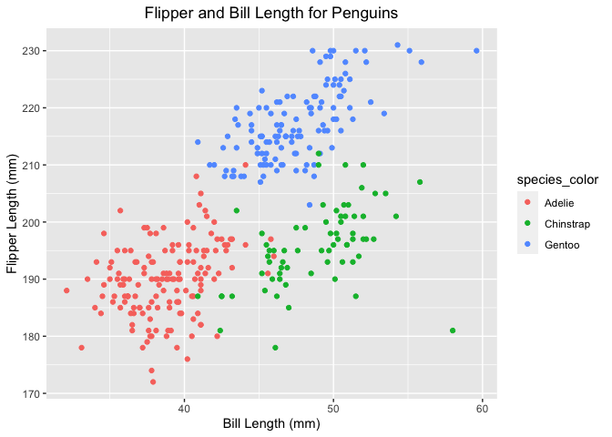

p8105_hw1_pw2551
================
Paula Wu
9/23/2021

``` r
# I set message = FALSE for concision
library(tidyverse)
```

### **Problem 1**:

Create a data frame with variables:

``` r
set.seed(1)
p1_df = tibble(
  vec_numeric = rnorm(10),
  vec_logical = vec_numeric > 0,
  vec_char = c("will", "you", "get", "a", 
                 "headache", "if", "you", "think", "too", "hard"),
  vec_factor = factor(c("high", "low", "medium", "high", "medium", 
                        "medium", "low", "high", "high", "low"))
)
p1_df
```

    ## # A tibble: 10 × 4
    ##    vec_numeric vec_logical vec_char vec_factor
    ##          <dbl> <lgl>       <chr>    <fct>     
    ##  1      -0.626 FALSE       will     high      
    ##  2       0.184 TRUE        you      low       
    ##  3      -0.836 FALSE       get      medium    
    ##  4       1.60  TRUE        a        high      
    ##  5       0.330 TRUE        headache medium    
    ##  6      -0.820 FALSE       if       medium    
    ##  7       0.487 TRUE        you      low       
    ##  8       0.738 TRUE        think    high      
    ##  9       0.576 TRUE        too      high      
    ## 10      -0.305 FALSE       hard     low

Take the mean of each variable:

``` r
# pulled each columns from the data frame for future uses
numeric_col = pull(p1_df, vec_numeric)
logical_col = pull(p1_df, vec_logical)
char_col = pull(p1_df, vec_char)
factor_col = pull(p1_df, vec_factor)

# calculate means
mean(numeric_col)
## [1] 0.1322028
mean(logical_col)
## [1] 0.6
mean(char_col)
## Warning in mean.default(char_col): argument is not numeric or logical: returning
## NA
## [1] NA
mean(factor_col)
## Warning in mean.default(factor_col): argument is not numeric or logical:
## returning NA
## [1] NA
```

-   Taking the means for numeric and logical variables works. It’s
    because numeric and logical variables have arithmetic values:
    numeric variables have their literal values, while logical variables
    have 1 for TRUE and 0 for FALSE. <br>
-   Taking means for character and factor variables doesn’t work,
    because neither of them have arithmetic values that can be added or
    divided. <br>

To explicitly convert types:

``` r
as.numeric(logical_col)
as.numeric(char_col)
as.numeric(factor_col)
```

-   The conversion works for logical and factor variables but **not**
    for character variables. <br>
-   For logical variables, the method `as.numeric()` will convert TRUE
    to 1 and FALSE to 0. <br>
-   For factor variables, according to *rdocumentation.com*,
    `as.numeric()` will return the underlying numeric representation.
    Since there are three “levels” for factor variables, each of the
    element is converted to its arbitrarily corresponding number. <br>
-   For character variables, `as.numeric()` gives us a “NAs introduced
    by coercion” warning. Texts just can’t be converted into numbers.
    <br>
-   `as.numeric()` helps explain why logic variables work and character
    variables don’t work when I tried to take the mean. However, it
    doesn’t help explain why factor variables don’t work: factor
    variables can be converted to numeric variables based on their
    levels, but applying the `mean()` function on factor variables
    yields an NA result. <br>

### **Problem 2**:

Download and read dataset:

``` r
# packages installed in the terminal
data("penguins", package = "palmerpenguins")
penguins
```

    ## # A tibble: 344 × 8
    ##    species island    bill_length_mm bill_depth_mm flipper_length_mm body_mass_g
    ##    <fct>   <fct>              <dbl>         <dbl>             <int>       <int>
    ##  1 Adelie  Torgersen           39.1          18.7               181        3750
    ##  2 Adelie  Torgersen           39.5          17.4               186        3800
    ##  3 Adelie  Torgersen           40.3          18                 195        3250
    ##  4 Adelie  Torgersen           NA            NA                  NA          NA
    ##  5 Adelie  Torgersen           36.7          19.3               193        3450
    ##  6 Adelie  Torgersen           39.3          20.6               190        3650
    ##  7 Adelie  Torgersen           38.9          17.8               181        3625
    ##  8 Adelie  Torgersen           39.2          19.6               195        4675
    ##  9 Adelie  Torgersen           34.1          18.1               193        3475
    ## 10 Adelie  Torgersen           42            20.2               190        4250
    ## # … with 334 more rows, and 2 more variables: sex <fct>, year <int>

-   The variable names are: species, island, bill_length_mm,
    bill_depth_mm, flipper_length_mm, body_mass_g, sex, year. Among
    these 8 attributes, “bill_length_mm”, “bill_depth_mm”,
    “flipper_length_mm”, and “body_mass_g” look important and meaningful
    to me. The values, specifically the mean values, for these important
    variables will be calculated in r code chunks below. <br>

``` r
# I get rid of the Null values
bill_l = mean(pull(penguins, bill_length_mm), na.rm = TRUE)
bill_d = mean(pull(penguins, bill_depth_mm), na.rm = TRUE)
flip_l = mean(pull(penguins, flipper_length_mm), na.rm = TRUE)
body_m = mean(pull(penguins, body_mass_g), na.rm = TRUE)
c(bill_l, bill_d, flip_l, body_m)
## [1]   43.92193   17.15117  200.91520 4201.75439
```

-   Thus, the means, rounded to 2 decimal places, for “bill_length_mm”
    is 43.92, for “bill_depth_mm” is 17.15, for “flipper_length_mm” is
    200.92, and for “body_mass_g” is 4201.75. <br>
-   For this penguins data set, there are 344 rows and 8 columns. <br>
-   The mean of flipper length (mm) is mentioned above, which is 200.92.
    <br>

To plot the scatterplot using `ggplot`:

``` r
ggplot(penguins, aes(x = bill_length_mm, y = flipper_length_mm, col = species)) + 
  geom_point() + 
  ggtitle("Flipper and Bill Length for Penguins") + 
  theme(plot.title = element_text(hjust = 0.5)) +
  labs(y = "Flipper Length (mm)", x = "Bill Length (mm)")
```

    ## Warning: Removed 2 rows containing missing values (geom_point).

<!-- -->

To save the graph using `ggsave`:

``` r
ggsave("./scatterplot.pdf", height = 4, width = 6)
```

    ## Warning: Removed 2 rows containing missing values (geom_point).
